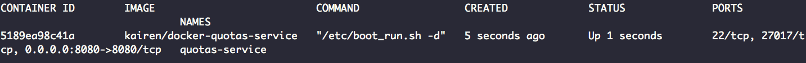

# OpenStack Monitor Quotas Service 
本專案為 OpenStack Monitor Quotas Service 的 Docker 套件，透過該套件監控叢集資源使用狀況，並轉換為 APIs 方式存取。

### Quick Start
**從 Docker Hub 下載 Image：**
```sh
docker pull imaccloud/docker-quotas-service:1.0.0
```

**執行 Quotas Service Container：**
```sh
docker run -d --name quotas-service \
-p <expose_port>:8080 \
-e MYSQL_HOST="10.21.20.118" \
-e MYSQL_USER="root" -e MYSQL_PASSWORD="password" \
-e KEYSTONE_HOST="10.21.20.118" -e KEYSTONE_PORT="5000" \
imaccloud/docker-quotas-service:1.0.0 -d
```

>  ```<expose_port>``` 是 quotas service 容器要對應的服務 port，若沒安裝 ```Swift```套件，並使用到 ```8080``` 的話，可以輸入該 port，若該 port 已被使用，請使用其他無服務的 port。

> ```MYSQL_HOST``` 是外部 MySQL 的 Domain name 或 IP，請提供一個 OpenStack 使用的 MySQL。

> ```MYSQL_USER``` 是外部 MySQL 的使用者帳號，請提供一個 OpenStack 使用的 MySQL 帳號。

> ```MYSQL_PASSWORD``` 是外部 MySQL 的使用者密碼，請提供一個 OpenStack 使用的 MySQL 密碼。

> ```KEYSTONE_HOST``` 是 OpenStack 的 Keystone 套件的 Domain name 或 IP。

> ```KEYSTONE_PORT``` 是 OpenStack 的 Keystone 套件的服務 port。

**執行 Quotas Servicer Contrainer 的 Debug 模式：**
```sh
docker run --name quotas-service -ti \
-p 8080:8080 \
-e MYSQL_HOST="10.21.20.118" \
-e MYSQL_USER="root" -e MYSQL_PASSWORD="password" \
-e KEYSTONE_HOST="10.21.20.118" -e KEYSTONE_PORT="5000" \
imaccloud/docker-quotas-service:1.0.0 bash
```
> 此模式可以進入 Container 進行 Debug，也可以看到 APIs 的 response 狀態。

**使用外部的 MongoDB 儲存 Quotas 資料：**
```sh
docker run -d --name quotas-service \
-p <expose_port>:8080 \
-e MYSQL_HOST="10.21.20.118" \
-e MYSQL_USER="root" -e MYSQL_PASSWORD="password" \
-e KEYSTONE_HOST="10.21.20.118" -e KEYSTONE_PORT="5000" \
-e MONGO_DB_HOST="10.21.20.118" -e MONGO_DB_PORT="27017" \
-e MONGO_DB_USER="log" -e MONGO_DB_PASSWORD="log" -e MONGO_DB="log_service" \
imaccloud/docker-quotas-service:1.0.0 -d
```

> ```MONGO_DB_HOST``` 是用來儲存與檢索 Monitor Quotas 的 MongoDB 伺服器 Domain name 或 IP。

> ```MONGO_DB_PORT``` 是 MongoDB 服務 port。

> ```MONGO_DB_USER``` 是 MongoDB 使用者帳號。

> ```MONGO_DB_PASSWORD``` 是 MongoDB 使用者密碼。

> ```MONGO_DB``` 是 MongoDB 的資料庫名稱。

### 驗證服務
當服務成功如下圖啟動了 Container 後：



我們可以透過進入 OpenStack Dashboard 選擇一個 Project，並建立一個 Instance 來讓 Quotas 記錄套件可以記錄目前變化。

每當 Instance 被```新增```或```刪除```時，Quotas 記錄套件都會記錄狀態，我們可以透過 API 的方式取得目前資訊，其 URL 格式如下：
```sh
http://<host>:<port>/quotas/<project_id>/<resource>/?start_time=<start_timestamp>&end_time=<end_timestamp>
```
> ```<host>``` 是該服務套件的主機 Domain name 或 IP。

> ```<port>``` 是該服務套件的主機服務 Port。

> ```<project_id>``` 是 OpenStack 的 Project ID（Tenant ID）。

> ```<resource>``` 是可取得資源的名稱。有以下幾個資源：
* **instances**：目前使用的 instances 數量。
* **ram**：目前使用的 RAM 資源。
* **cores**：目前使用的 Core 數量。

> ```<start_timestamp>``` 是所要取得的 Quotas 記錄資料的開始時間戳。

> ```<end_timestamp>``` 是所要取得的 Quotas 記錄資料的結束時間戳。

**使用 Curl 驗證：**

如果不是透過 App 進行驗證，我們要先取得 token，透過以下 command 取得：
```sh
curl -d '{ "auth": { "tenantName": "admin", "passwordCredentials": { "username": "admin", "password": "password" } } }' -H "Content-Type: application/json" http://10.21.20.118:5000/v2.0/tokens
```
取得 ```<token>``` 後，我們將對 API 做請求，使用以下指令取得：
```sh
curl -H "Content-Type: application/json" -H "X-Auth-Token: <token>" http://192.168.99.100:8080/quotas/61235f879e7b4908a6d2895aa26532fe/ram/?start_time=1443591059&end_time=1443691106
```
若成功的話，會回傳時間之內的 RAM 的 JSON 資料：
```json
[
    {
        "timestamp": "1443622753.0",
        "project_id": "61235f879e7b4908a6d2895aa26532fe",
        "resource": "ram",
        "value": "64",
        "_id": "560bef6e1b0d96002ff79e71"
    },
    {
        "timestamp": "1443622753.0",
        "project_id": "61235f879e7b4908a6d2895aa26532fe",
        "resource": "ram",
        "value": "0",
        "_id": "560bef6e1b0d96002ff79e74"
    }
]
```
若 ```<token>``` 過期的話，會回傳以下錯誤資訊：
```json
{
	"error":{
		"message":"The request you have made requires authentication. (Disable debug mode to suppress these details.)",
		"code":401,
		"title":"Unauthorized"
	}
}
```
